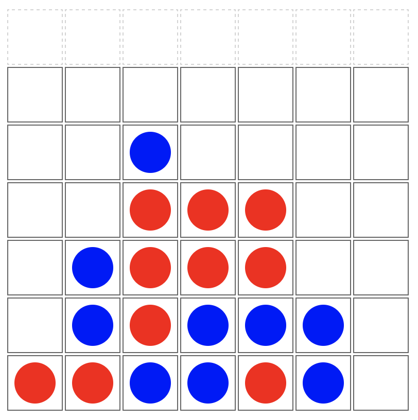

============
Connect Four
============

.. dl-code::

In this exercise, you'll plan & help code a Connect Four game in JavaScript.

The Game
========

Connect Four is played on a grid, 7 wide by 6 deep, with two players,
1 (which will have red pieces) and 2 (blue pieces). The players alternate turns,
dropping a piece of their color in the top of a column. The piece will fall
down to the furthest-down unoccupied slot.

The game is won when a player makes four in a row (horizontally, vertically,
or diagonally). The game is a tie if the entire board fills up without a
winner.

You can `try out the game online <https://rithm-connect4.netlify.app>`_.

Tests
=====

We have provided tests for the game in :file:`connect4.test.js`. To run these
tests, navigate to the folder in your shell and run ``vitest --run``.

Most tests will initially fail. Run the tests after each step you complete
to ensure the tests for the function(s) in that step are passing---they should
be passing before you move on or request a code review.

Steps
=====

Step 1: Starter code
--------------------

Game state
++++++++++

Our code has an object called `gameState` that has two properties:

`board`
  A matrix for the board --- an array of rows, where the values in the rows
  will either be ``null`` (for no piece placed), or the player number (``1`` or ``2``)
  of the piece placed there.

  .. container:: compare

    .. container:: width-35

      :dark-green:`Table in browser DOM:`

      .. raw:: html

        

      .. csv-table::
        :class: table-unstriped td-padding-1 width-100 td-center-all
          font-size-85 c4table

        ,,,,,,
        ,,,,,,
        ,,,,,,
        ,,,,,,
        ,,,,,,
        ,`⬤`:blue:,,`⬤`:red:,,,

    .. container:: width-45

      :dark-green:`JS` `board` :dark-green:`variable:`

      .. code-block:: js
        :class: code-cols-50

        [
          [ null, null, null, null, null, null, null ],
          [ null, null, null, null, null, null, null ],
          [ null, null, null, null, null, null, null ],
          [ null, null, null, null, null, null, null ],
          [ null, null, null, null, null, null, null ],
          [ null,    2, null,    1, null, null, null ],
        ];

`currPlayer`
  Either 1 or 2

Separation of Concerns
++++++++++++++++++++++

Take a few minutes and study what lives in :file:`connect4.js` and what
lives in :file:`ui.js`. We've purposely divided our code this way to
separate the logic from the DOM manipulation.

Game State & the UI
+++++++++++++++++++

Our code uses the `gameState.board` property to hold the state of the
board (when a piece is played by a player, it should be updated).

When a player places a piece, the code will also update the HTML table,
so that the the piece is visible in the browser.

Step 2: `makeBoard`
-------------------

The `makeBoard()` function needs to be implemented. It should update the game
state `board` array such that each of the 6 (height) indexes contains an
array of 7 (width) indexes.

Write code that sets the values in the inner arrays to have `null` (no piece
played) for every spot, using the `HEIGHT` and `WIDTH` variables, rather than
hard-coding the height & width.

Implement this function to make this board dynamically.

Step 3: `makeHTMLBoard`
-----------------------

This function should use the height and width of the game board to dynamically
create the HTML table game board. There are a few missing pieces.

- Add the missing internal comments (denoted by TODO).

- The main part of the HTML game board is created using two for loops, one nested
  within the other. You'll write the code to fill in all code within these two
  loops:

  - Create a table row element and assign to a `$row` variable.

  - Create a table cell element and assign to a `$cell` variable. Add an id like
    :samp:`c-{y}-{x}`, to represent coordinates for this cell, which will assist you later
    when you may want to identify the row and column of a specific cell (see the
    code comments to understand what this ID should be).

  - Append the table cell you created to the table row you created.

  - Append the row you created to the HTML board.

.. attention:: Stop and get a code review

  We'd like to look at your code at this point --- please ask an
  instructor to review your work so far, and be prepared to discuss
  the choices you've made and why.

Step 4: `findSpotInCol`
------------------------

Right now, the game always drops a piece to the bottom of the column,
even if a piece is already there. Fix this function so that it finds the
lowest empty spot in the game board and returns the y coordinate (or
`null` if the column is filled).

Step 5: `placeInTable` & CSS
----------------------------

This function should add a `div` inside the correct `td` cell in the HTML game
board. This div should have the `piece` class on it, and should have a class
for whether the current player is 1 or 2, like `p1` or `p2`.

Update the CSS file to:

- make the piece `div` round, not square

- be different colors depending on whether it's a player #1 or #2 piece

While not everything will work, you should now be able to call `placeInTable`
with an x and y coordinate and see a piece appear there on the game board.

Step 6: `checkForWin`
---------------------

The `checkForWin()` uses a function defined within it `_win()` to help check
the board cell-by-cell to determine if there is a winner. To win, a player must
get four cells in a row (horizontal, vertical, or diagonal).

- Take a moment to read the comment for the inner `_win()` function. Write the
  code necessary to check each pair of cell coordinates to see if they're all
  legal (in bounds of the board) and if they all match the current player.

- We're using two for loops, one nested within the other, to create lists of
  cell coordinates for each of the possible ways to win. These lists will be
  checked using the `_win()` function. The horizontal list has been created.
  Assign values to each of the remaining directions that need to be checked.

.. note:: Algorithm for finding a winner

  This is a good strategy for finding a winner, but it's not the most
  efficient and would slow things down if people played connect four on 100x100
  board. Later in your algorithmic learning, you may learn ways to find winners that don't keep
  re-checking the same area of the board (using techniques for "dynamic
  programming", you can make this code more efficient).

  This is not in scope for this exercise.

Step 7: `handleClick`
---------------------

There are several TODO comments in this function; please handle them
in order, one-by-one.

- this never updates the `board` state about the newly-placed-piece. Fix.

- add a check for "is the entire board filled" [hint: the JS `every` method
  on arrays would be especially nice here!] to see if there is a tie

- add code to switch `currPlayer` between 1 and 2. You'll need to fill in the
  `switchCurrPlayer` function in `connect4.js` (this could be a great place
  for a ternary!) and leverage it here.

Step 8: Celebrate :emoji:`🎉`
-----------------------------

If you got this far, you should have a fully functional Connect Four game and
all tests should be passing. Congratulations!

.. attention:: Stop and get a code review

  We'd like to look at your code at this point --- please ask an
  instructor to review your work so far, and be prepared to discuss
  the choices you've made and why.

Further Study
=============

Step 9: Animation
-----------------

You can learn about CSS animation features (check out MDN!). If you change the
`.piece` divs to be positioned absolutely, you can animate the `top` CSS
property to animate the pieces so they appear to drop down. This is tricky,
but will give you a chance to play with animations, as well as
working with relative/absolute positioning.

========
Solution
========

.. dl-solution::

.. toctree::

  solution/index
